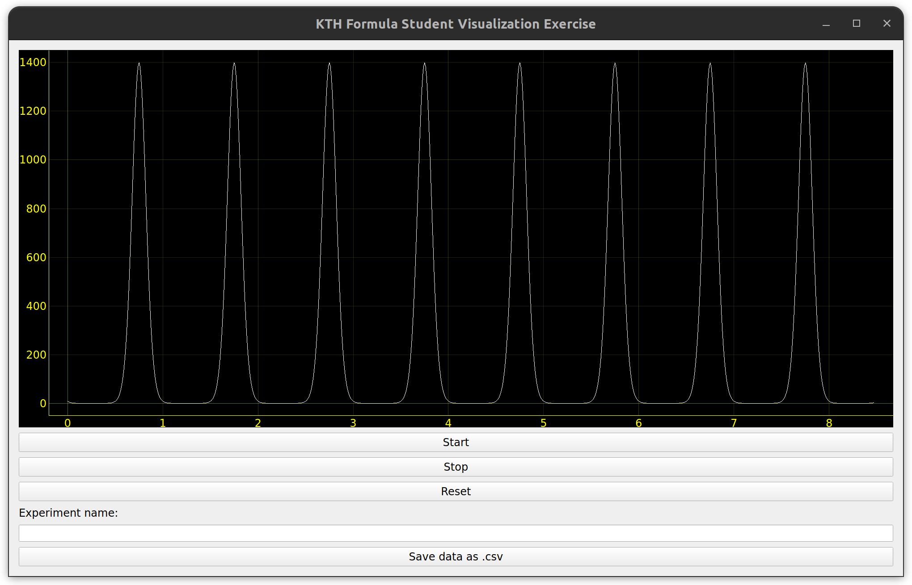

# KTHFS_exercise2
GUI visualization of a function over time implemented using PyQT5 as part of the application process at KTH Formula Student.

## Python package requirements
- PyQt5
- pyqtgraph
- numpy

## Run the visualizer
Execute the .py file in a terminal:
    
    $ python visualizer.py

## Visualizer features
As the visualizer was created using PyQt5, interaction with the plot window is possible and allows to zoom in and out as well as move the currently visualized area of the graph using the mouse.

**Additionally, following features were implemented:**
- Plot updates in real-time
- Start and stop buttons to allow pausing the calculation and plotting of the data
- Export to .csv functionality *(saves data in a .csv file in the current directory of visualizer.py The file is named after the experiment name you can type in the textbox in the gui + a 'YYYY-MM-DD_HH-MM-SS_' timestamp as prefix)*

## Screenshot of the visualizer GUI
